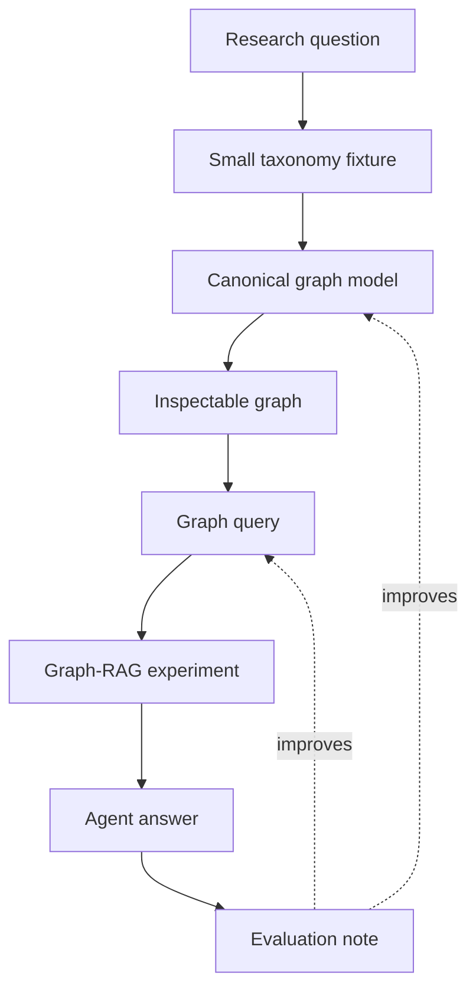
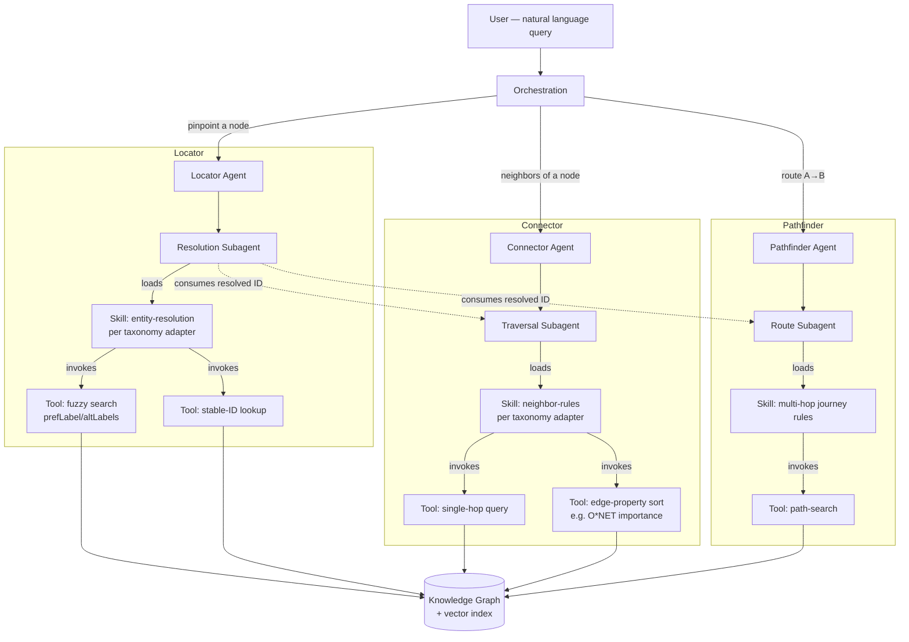

# Architecture Blueprint: Agent and Technological Infrastructure

**Phase:** 2 of 6 (specdriven.ai) · **Checkpoint:** Architecture review [cite: 2]
**Governing Document:** `constitution.md` [cite: 1]

## 1. Architectural Intent and Goals

The fundamental objective of this architectural blueprint is to delineate a reproducible, evaluated framework upon which the Locator, Connector, and Pathfinder agents shall operate [cite: 1]. The system is structurally designed to facilitate contributor comprehension across disparate skills and occupation taxonomies, enabling the systematic modeling of each taxonomy as an inspectable graph [cite: 5]. This architecture explicitly constitutes a preliminary methodological approach designed for exploration, deliberately omitting production-grade deployment requirements or cross-taxonomy crosswalk formulations at this juncture [cite: 1, 5]. 

## 2. Conceptual Map

The architecture is systematically organized around a deterministic pipeline, ensuring that every experimental iteration produces a reproducible fixture, an inspectable graph representation, and an evaluative summary [cite: 5].

*Note: The primary heuristic is defined not by service ownership, but by the capacity of a contributor to reproduce the graph and inspect the underlying computational reasoning [cite: 5].*

## 3. Source Taxonomies and Ingestion Strategy

The system evaluates five primary reference taxonomies [cite: 5]. Because these sources do not inherently share a unified structural schema, the architecture dictates the implementation of taxonomy-specific adapters that map native structures into a universally interpretable interface [cite: 1].

| Source | Utility Domain | Structural Modeling Challenge |
| :--- | :--- | :--- |
| **ESCO** | Occupations, skills, and corresponding qualifications [cite: 5]. | Requires accommodation of semantic-web structures and multilingual nomenclature [cite: 5]. |
| **O\*NET** | Occupations, constituent tasks, skills, and work activities [cite: 5]. | Necessitates the translation of relational tables and complex rating scales [cite: 5]. |
| **SFIA** | Digital competencies and standardized proficiency strata [cite: 5]. | Demands resolution of responsibility hierarchies and progressive skill levels [cite: 5]. |
| **BLS** | Occupational outlook data and macroeconomic labor contexts [cite: 5]. | Requires synthesizing prose-based profiles with statistical data configurations [cite: 5]. |
| **Lightcast** | Labor-market skill indicators and job-title frequency signals [cite: 5]. | Entails managing proprietary licensed schemas and dynamic commercial data [cite: 5]. |

## 4. Canonical Graph Vocabulary

To ensure robust comparability across analytical experiments, the architecture mandates a standardized, highly constrained ontological vocabulary [cite: 5].

### Foundational Nodes
| Node Classification | Semantic Definition |
| :--- | :--- |
| `Skill` | A demonstrable or acquirable professional capability [cite: 5]. |
| `Task` | A discrete unit of labor or operational activity [cite: 5]. |
| `Occupation` | A defined professional role or broader job family [cite: 5]. |
| `Framework` | The originating taxonomy or institutional standard [cite: 5]. |
| `Level` | A delineated stratum of proficiency or organizational responsibility [cite: 5]. |
| `Evidence` | Corroborating source text, database entries, or formal citations [cite: 5]. |

### Relational Edges
| Edge Designation | Semantic Definition |
| :--- | :--- |
| `HAS_SKILL` | Denotes that an occupation or task structurally incorporates a specific skill [cite: 5]. |
| `PERFORMS_TASK` | Indicates that a given occupation encompasses a specific task [cite: 5]. |
| `BROADER_THAN` | Establishes a definitive hierarchical subordination between conceptual nodes [cite: 5]. |
| `RELATED_TO` | Defines a lateral, non-hierarchical conceptual association [cite: 5]. |
| `HAS_LEVEL` | Connects a skill to its explicitly described proficiency threshold [cite: 5]. |
| `SUPPORTED_BY` | Links a node or edge directly to its foundational source evidence [cite: 5]. |
| `MAY_LEAD_TO` | Signifies a mathematically or theoretically probable career or educational progression [cite: 5]. |

## 5. Agent Topology and Operational Modes

The orchestration layer interfaces with three autonomous agents, each governing a specific conceptual retrieval mode [cite: 5]. 

| Operational Mode | Query Topology | Required Graph Operation |
| :--- | :--- | :--- |
| **Locator** | "Where is X?" [cite: 5]. | Executes entity resolution to locate and systematically disambiguate a target node [cite: 5]. |
| **Connector** | "What is connected to X?" [cite: 5]. | Evaluates adjacent neighbor nodes and assesses the properties of connecting edges [cite: 5]. |
| **Pathfinder** | "How do I get from X to Y?" [cite: 5]. | Executes directional, multi-hop search algorithms to establish valid relational paths [cite: 5]. |

**Delegation Mechanics:**
Orchestration selectively delegates natural-language queries [cite: 2]. The Locator agent solely owns entity resolution, ensuring that the Connector and Pathfinder subsequently consume stable identifiers rather than duplicating resolution algorithms [cite: 2].

## 6. Technological Infrastructure

The specified technological stack balances the necessity for advanced cognitive processing with the imperative of infrastructural parsimony.

| Architectural Layer | Selected Technology | Functional Justification |
| :--- | :--- | :--- |
| **Graph Store** | Neo4j | Preserves the antecedent Cypher-native queries formulated during the initial taxonomy modeling sprint [cite: 2]. |
| **Vector Index** | Supabase pgvector | Co-locates vector embeddings alongside relational metadata to circumvent unnecessary infrastructural bloat [cite: 2]. |
| **Agent Framework** | LangGraph | Supplies robust native primitives for executing the requisite agent-subagent delegation hierarchy [cite: 2]. |
| **Model Provider** | Anthropic Claude (API) | Maintains uninterrupted alignment with pre-existing computational tooling established within the repository [cite: 2]. |

## 7. Retrieval Strategy and Query Lifecycle

The methodological retrieval sequence eschews opaque heuristic synthesis in favor of a strictly traceable Graph-RAG pattern [cite: 5].

**Procedural Flow:**
1. Receipt of the natural-language query [cite: 5].
2. Execution of candidate node lookup via semantic vector search [cite: 5].
3. Methodical graph expansion to ascertain traversal pathways [cite: 5].
4. Aggregation of corresponding corroborating evidence [cite: 5].
5. Algorithmic generation of the synthesized answer [cite: 5].
6. Explicit exposure of the data provenance to the end-user [cite: 5].

Semantic search paradigms are utilized exclusively to locate candidate nodes, whereas rigorous graph traversal functions to validate the empirical relationships, ensuring the agent does not fabricate theoretical edges absent from the source data [cite: 5].

## 8. Evaluation and Compliance Directives

The architecture mandates strict evaluative compliance for all experimental iterations [cite: 5]. 

*   **Ingestion Integrity:** Assertions must verify that every source fixture row translates accurately into the prescribed nodes and edges [cite: 5].
*   **Graph Cohesion:** Models must be structurally validated to guarantee an absence of dangling or orphaned edges [cite: 5].
*   **Agentic Accuracy:** Locator outputs must align with expected conceptual identities; Connector algorithms must return exclusively legitimate graph neighbors; and Pathfinder routines must commence and terminate precisely at the requested conceptual boundaries [cite: 5]. 
*   **Provenance:** All synthesized responses must possess direct citations anchored unequivocally in the designated fixture evidence [cite: 5].
